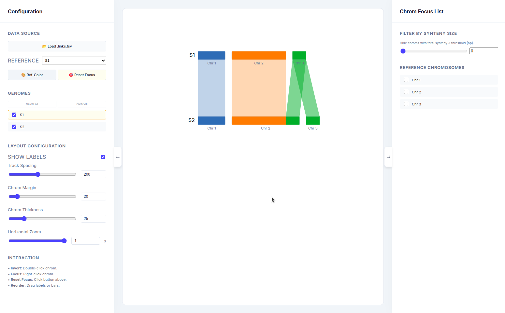

# FunMacroSynteny

View macrosynteny with fun!

## Inspiration

We took inspiration from macrosynteny visualization from ntsynt-viz, a very quick and easy way to:
- Compare effects of using different assemblies/params
- Assess how much the genomes evolved structurally between different species
- See how much damage the genomes that make it into NCBI Genbank

but the static image is annoying.

> "There must be a better way."
> — *Raymond Hettinger*

So, we create FunMacroSynteny because only when it is fun, then it makes it people want to check their genomes.

## Dependencies

Maybe just python, to serve the web app? And a web browser? That is it! Let the browser work for you!

## Usage

Just
`python -m http.server 8000`

or any other port.

You will see an easy demo (like the picture on top). Just load in your `.links.tsv` file from ntsynt. 

And I think from there, you should be able to figure out how to use it. Enjoy!

## Features

- Focus mode. Right click on a chromosome of a ref genome to toggle focus mode on selected chromosome, or select chromosomes to focus on the right sidebar.
- Click on a block, and a toast message reports the block `start-stop(size)`.

## Future features to add
- Can we work on PAF formats?! That would be amazing.
- Rename genomes
- Save state
    - Important if we have worked on moving/hiding genomes, renamed genomes, etc.
    - Into separate json file? Exporting to html?
- Export svg/html.
    - Export to html is a crazy feature. Can embed in websites, and also share with collaborators.
- Change color palette, maybe? Im happy with the colors for now.
- The chroms are fixed horizontally. Maybe we want to allow the chroms to be positioned differently
